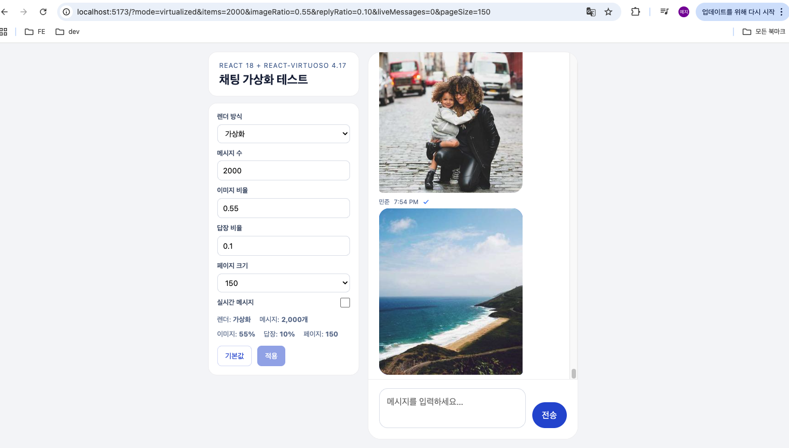
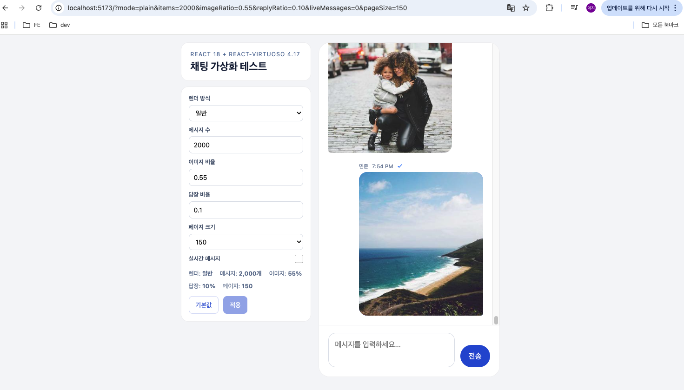

# 채팅 가상화 성능 비교 데모

React 18 + Vite 5 + TypeScript 5 + `react-virtuoso` 4.17 기반의 채팅 리스트 성능 비교 데모다.  
목표는 단순히 리스트를 가상화하는 것이 아니라, 실제 서비스에 가까운 채팅 패턴을 재현한 뒤 일반 렌더링(`.map()`)과 가상화 렌더링(`react-virtuoso`)을 같은 조건에서 비교하는 것이다.

| 가상화 리스트 | 일반 리스트 |
|---|---|
|  |  |

## 왜 이 데모가 필요한가

일반적인 리스트 벤치마크는 텍스트만 있는 균일한 행 높이 데이터셋으로 끝나는 경우가 많다. 하지만 실제 채팅 UI는 다음 요소들 때문에 훨씬 복잡하다.

- 날짜 구분선처럼 메시지 외 아이템이 섞인다.
- 답장 프리뷰, 이미지 메시지 때문에 아이템 높이가 자주 달라진다.
- 위쪽 prepend 페이지네이션에서 스크롤 위치 유지가 중요하다.
- 새 메시지 수신 시 자동 하단 이동과 자동 이동 억제가 함께 필요하다.
- 이미지 로딩 시 레이아웃 시프트(CLS)와 메모리 점유율까지 봐야 한다.

이 저장소는 위 조건을 모두 포함한 상태에서 plain 렌더링과 virtualized 렌더링을 비교할 수 있게 만든다.

## 데모에서 재현하는 패턴

- 결정론적 데이터 생성: `mulberry32` 시드 기반으로 같은 파라미터면 항상 같은 대화 데이터 생성
- 혼합 리스트 아이템: 메시지, 날짜 구분선, unread 구분선 동시 렌더링
- `firstItemIndex` prepend 페이지네이션: 위로 스크롤할 때 이전 페이지 로드 후 뷰포트 유지
- `followOutput` 자동 스크롤: 하단에 있을 때만 새 메시지를 따라감
- Return to Latest 버튼: 자동 스크롤이 꺼진 상태에서 최신 메시지로 복귀
- 답장 메시지 타입: 실제 채팅처럼 가변 높이 버블 렌더링
- 실시간 메시지 시뮬레이션: 2~4초 간격 append
- 낙관적 UI: `sending -> sent` 상태 전환
- 이미지 CLS 대응: 이미지 실제 크기를 데이터에 넣고 `aspect-ratio`로 공간 선점
- 내장 계측 API: Long Task, CLS, DOM 수, 이미지 로딩 수, 힙/메모리 측정

## 빠른 시작

```bash
bun install
bun run dev
```

브라우저에서 [http://localhost:5173](http://localhost:5173) 접속.

성능 비교는 개발 서버보다 프로덕션 빌드가 더 적절하다.

```bash
bun run build
bun run preview
```

## 추천 시나리오

가장 먼저 보기 좋은 URL:

```text
http://localhost:5173/?mode=virtualized&items=5000&pageSize=150&imageRatio=0.25&replyRatio=0.15
```

plain 모드 비교:

```text
http://localhost:5173/?mode=plain&items=5000&pageSize=150&imageRatio=0.25&replyRatio=0.15
```

고부하 비교:

```text
http://localhost:5173/?mode=virtualized&items=10000&pageSize=150&imageRatio=0.35&replyRatio=0.2
```

## URL 쿼리 파라미터

모든 옵션은 URL에 반영된다. 같은 링크를 공유하면 같은 실험 조건을 그대로 재현할 수 있다.

| 파라미터 | 설명 | 기본값 |
|---|---|---|
| `mode` | `virtualized` \| `plain` \| `plain-full` | `virtualized` |
| `items` | 메시지 수 (`10` ~ `10000`) | `500` |
| `imageRatio` | 이미지 메시지 비율 (`0` ~ `1`) | `0.3` |
| `replyRatio` | 답장 메시지 비율 (`0` ~ `0.5`) | `0.1` |
| `pageSize` | 초기/추가 로드 페이지 크기 (`50/100/150/300`) | `150` |
| `liveMessages` | 실시간 메시지 시뮬레이션 (`1` \| `0`) | `0` |

툴바에서 값을 바꾼 뒤 `적용` 버튼을 눌러야 실제 목록과 URL에 반영된다.

## 비교할 때 봐야 하는 포인트

### 1. 초기 렌더

- plain 모드는 메시지 수가 커질수록 DOM 노드 수와 메모리 사용량이 함께 증가한다.
- virtualized 모드는 실제로 보이는 범위 위주로 렌더링되기 때문에 DOM 수가 훨씬 안정적이다.

### 2. 빠른 스크롤

- plain 모드는 긴 리스트에서 Long Task가 늘어나기 쉽다.
- virtualized 모드는 빠른 스크롤에서도 프레임 비용이 더 일정하다.

### 3. prepend 페이지네이션

- 상단 도달 시 이전 페이지를 prepend 하더라도 기존 스크롤 위치가 크게 흔들리면 안 된다.
- `__paginationPerf`로 top shift / height shift를 확인할 수 있다.

### 4. 이미지와 가변 높이

- 이미지 메시지와 답장 프리뷰가 섞이면 레이아웃 비용이 커진다.
- 이 데모는 이미지 `width/height`를 생성 단계에서 함께 만들고, 렌더 단계에서 `aspect-ratio` 프레임을 먼저 배치해 CLS를 줄인다.

## 브라우저 콘솔 계측 API

앱이 시작되면 계측 도구가 자동으로 `window`에 등록된다. 별도 스크립트 붙여넣기 없이 바로 사용 가능하다.

### `__chatPerf`

```js
__chatPerf.getSupport()
__chatPerf.startObservers()
__chatPerf.startLongTasks()
__chatPerf.startLayoutShifts()
__chatPerf.sample('baseline')
await __chatPerf.measureMemory('baseline-memory')
__chatPerf.exportCSV()
__chatPerf.reset()
```

주요 측정 항목:

- `domNodes`: 전체 DOM 노드 수
- `messageNodes`: 현재 렌더된 메시지 수
- `imageNodes`: 화면에 있는 이미지 수
- `loadingImages`: 아직 로딩 중인 이미지 수
- `heapUsed`: `performance.memory.usedJSHeapSize` 값
- `detailedMemoryBytes`: `measureUserAgentSpecificMemory()` 지원 시 더 정확한 메모리 값
- `longTaskCount`, `longTaskTotal`
- `layoutShiftCount`, `clsValue`

### `__paginationPerf`

```js
__paginationPerf.arm('before-prepend')
await __paginationPerf.autoCapture(300, 'after-prepend')
__paginationPerf.summary()
__paginationPerf.exportCSV()
```

주요 측정 항목:

- `maxTopShift`
- `maxHeightShift`
- `measuredItems`

## 권장 측정 흐름

### 초기 렌더 비교

1. 같은 URL 파라미터에서 `mode=plain-full` 또는 `mode=plain`으로 연다.
2. DevTools 콘솔에서 `__chatPerf.reset()` 실행.
3. `__chatPerf.startObservers()` 실행.
4. 페이지를 새로고침한다.
5. 렌더가 안정되면 `__chatPerf.sample('plain-initial')` 실행.
6. 가능하면 `await __chatPerf.measureMemory('plain-initial-memory')` 실행.
7. 같은 조건으로 `mode=virtualized`에서 반복한다.

### 스크롤/페이지네이션 비교

1. `__paginationPerf.arm('before-scroll')` 실행.
2. 빠르게 위로 스크롤해 prepend 로딩을 유도한다.
3. `await __paginationPerf.autoCapture(300, 'after-scroll')` 실행.
4. 이어서 `__chatPerf.sample('after-scroll')` 실행.

## 프로젝트 구조

```text
src/
  components/
    ChatShell.tsx
    VirtualizedMessageList.tsx
    PlainMessageList.tsx
    MessageBubble.tsx
  hooks/
    usePaginatedMessages.ts
    useLiveMessages.ts
    useQueryParams.ts
  mock/
    generateMessages.ts
    buildListItems.ts
  perf/
    attachPerfTools.ts
  styles/
    chat.css
```

## 참고 문서

- 상세 측정 절차: [docs/methodology.md](docs/methodology.md)
- 브라우저 콘솔용 참조 스크립트: [scripts/perf/browser-metrics.js](scripts/perf/browser-metrics.js), [scripts/perf/pagination-metrics.js](scripts/perf/pagination-metrics.js)

## 기대 결과 요약

| 시나리오 | 일반 렌더링 | 가상화 렌더링 |
|---|---|---|
| 대량 초기 렌더 | DOM·메모리 사용량이 아이템 수에 비례 | DOM 수와 비용이 상대적으로 안정적 |
| 빠른 스크롤 | Long Task 빈도 증가 가능 | 스크롤 비용이 더 일정 |
| prepend 페이지네이션 | 상단 로딩 시 흔들림 위험 | `firstItemIndex`로 위치 유지 |
| 이미지 혼합 | CLS·메모리 비용 증가 가능 | 이미지 공간 선점 + 화면 범위 위주 렌더링 |
